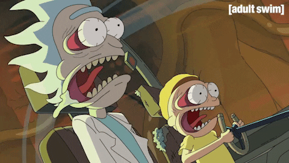

# Greetings, Cosmic Coder! I'm bar5um 🚀

  

Welcome to my intergalactic GitHub outpost. I’m a Software Engineer who crafts code like a starship navigating the nebula of tech. My mission? To build apps that spark joy, solve mysteries, and maybe save the galaxy (or at least a few deadlines). Think of me as a code-wielding Jedi with a penchant for sci-fi puns and pixel-perfect solutions.

## 🌌 My Tech Arsenal
*Armed with tools sharper than a lightsaber!*

- **Main Languages (My Daily Grind):**

  
  
  
  
  
  
- **Side Hustle Languages (For Fun & Glory):**

  
  
  
  
- **Frameworks**:

  
  
  
- **Tools**:

  
  
  
  
  

## 🌠 Current Mission Log
- Engineering a CMS using Laravel mostly for blogs and e-commerce
- Leveling up my skills in managing software teams

  

*Thanks for warping into my profile! Fork a repo, open an issue, or send a holo-message if you want to team up for a coding adventure!*
